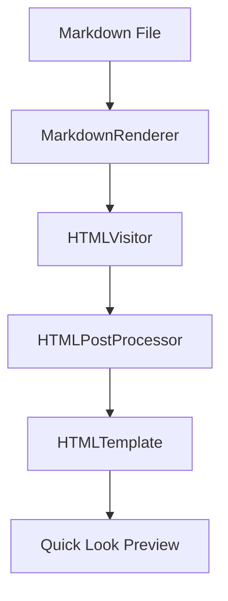
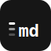

# showmd Feature Showcase

This file exercises all rendering features supported by showmd. Open it in Finder with Quick Look (press Space) to verify each feature renders correctly.

---

## Text Formatting

Regular text with **bold**, *italic*, ***bold italic***, ~~strikethrough~~, `inline code`, ==highlight==, super^script^, and sub~script~ formatting.

Smart quotes: "double quoted" and it's an apostrophe.

---

## Headings

### Third Level
#### Fourth Level
##### Fifth Level
###### Sixth Level

---

## Links and Autolinks

[Regular link](https://example.com)

Bare URL autolink: https://example.com/autolink-test

---

## Lists

### Unordered
- First item
- Second item
  - Nested item
  - Another nested
- Third item

### Ordered
1. First
2. Second
3. Third

### Task List
- [x] Completed task
- [ ] Incomplete task
- [x] Another done task

---

## Blockquotes

> This is a regular blockquote.
>
> It can have multiple paragraphs.

---

## GitHub-Style Alerts

> [!NOTE]
> This is a note alert. Useful for highlighting information that users should take into account.

> [!TIP]
> This is a tip alert. Optional information to help a user be more successful.

> [!IMPORTANT]
> This is an important alert. Crucial information necessary for users to succeed.

> [!WARNING]
> This is a warning alert. Critical content demanding immediate user attention due to potential risks.

> [!CAUTION]
> This is a caution alert. Negative potential consequences of an action.

---

## Code Blocks

Inline: `let x = 42`

Plain code block (no language):
```
just plain text
no syntax highlighting
```

### Swift
```swift
struct ContentView: View {
    @State private var count = 0

    var body: some View {
        Button("Count: \(count)") {
            count += 1
        }
    }
}
```

### JavaScript
```javascript
async function fetchData(url) {
  const response = await fetch(url);
  if (!response.ok) throw new Error(`HTTP ${response.status}`);
  return response.json();
}
```

### Python
```python
def fibonacci(n: int) -> list[int]:
    """Generate first n Fibonacci numbers."""
    fib = [0, 1]
    for _ in range(2, n):
        fib.append(fib[-1] + fib[-2])
    return fib[:n]
```

---

## Tables

| Feature | Status | Notes |
|---------|--------|-------|
| Bold | Done | Uses double asterisks |
| Alerts | Done | Five alert types |
| KaTeX | Done | Inline and block math |
| Mermaid | Done | Diagram blocks |

---

## Math (KaTeX)

Inline math: $E = mc^2$

Block math:

$$
\int_0^\infty e^{-x^2} dx = \frac{\sqrt{\pi}}{2}
$$

The quadratic formula: $x = \frac{-b \pm \sqrt{b^2 - 4ac}}{2a}$

---

## Mermaid Diagrams



---

## Emoji Shortcodes

:rocket: :thumbsup: :heart: :smile: :warning: :bulb:

---

## Footnotes

Here is a sentence with a footnote[^1] and another one[^2].

[^1]: This is the first footnote.
[^2]: This is the second footnote with more detail.

---

## Horizontal Rules

Above the rule.

---

Below the rule.

---

## Inline Image



---

## HTML Entities

Ampersand: &amp; — Less than: &lt; — Greater than: &gt; — Quote: &quot;

---

## Raw HTML (sanitized)

<details>
<summary>Click to expand</summary>

This content is inside a details/summary block.

</details>
